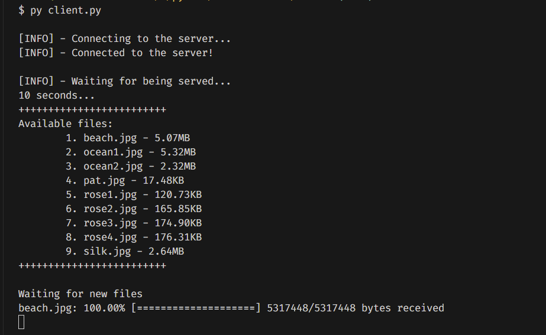

<h1 align="center" style="font-size: 54px">Socket Project</h1>

<strong>A socket application that allow to download files from server</strong>

  
  
  
  

  

## Usage

- Read the [documentation](./Source/readme.md) for more information

## Releases

- See the latest version [here](https://github.com/yuran1811/hcmus-socket/releases)

## App Screenshots

### Console UI

    
    

### GUI with customtkinter

    
    

### Rich UI

